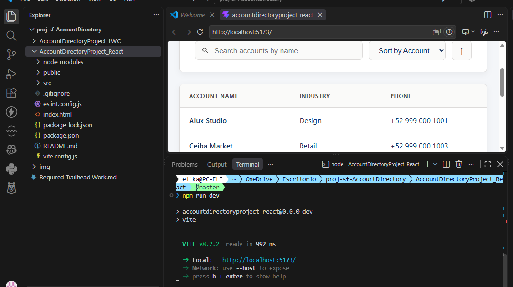
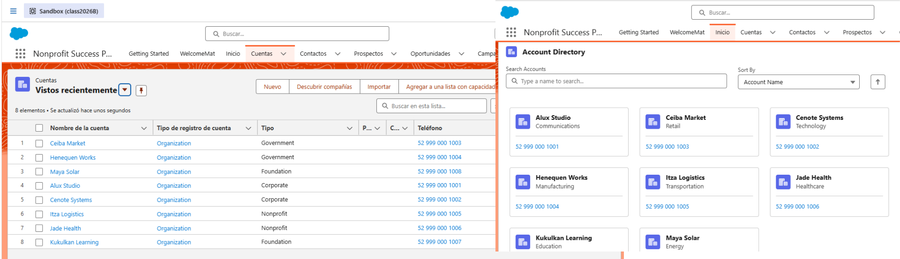
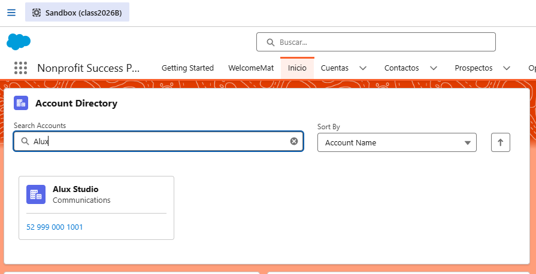
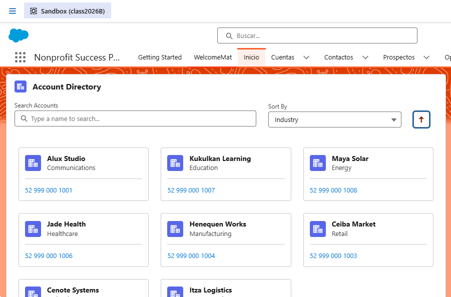
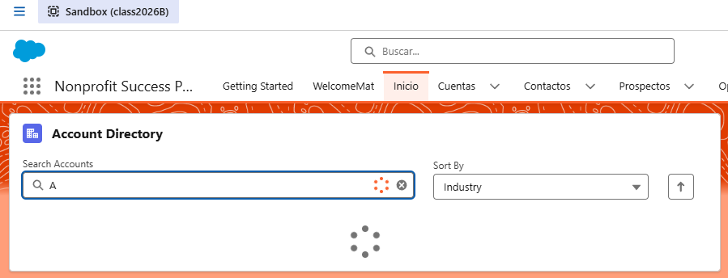
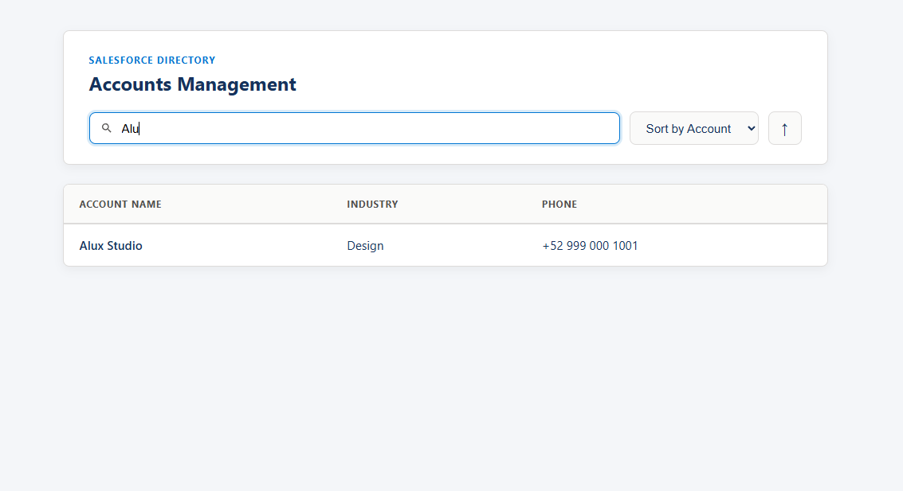
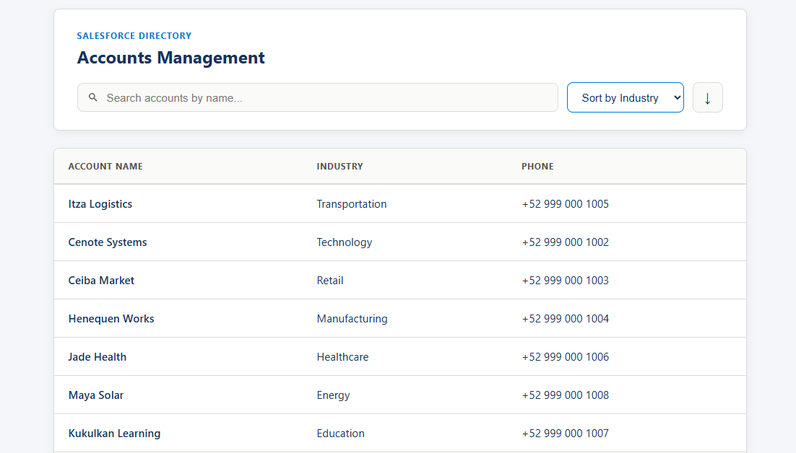

# Readiness_Rubric_Evidence

**Student:** Campos García Karen Elizabeth | **Team:** 2
**Facilitator:** ____________________ | **Verification Date:** ____________  

---

## 1. Required Trailhead Work (15 points)

**Trailhead Profile:** [https://www.salesforce.com/trailblazer/qelirhb9gjsa0smwtk](https://www.salesforce.com/trailblazer/qelirhb9gjsa0smwtk)

- [x] **Agentforce 360 Platform Development Basics completed** (5 points)
- [x] **Quick Start: Visual Studio Code for Salesforce Development completed** (5 points)
- [x] **Quick Start: Lightning Web Components completed** (5 points)

**Section Score:**  / 15

---

## 2. Working Development Environment (15 points)

- [x] Visual Studio Code and Salesforce Extension Pack working (4 points)

- [x] Salesforce CLI installed and responding (4 points)

- [x] Salesforce org authenticated from VS Code or CLI (4 points)

- [x] Node.js/npm and React development environment working (3 points)

**Section Score:**  / 15

---

## 3. Connected Salesforce Project (15 points)

- [x] **Valid Salesforce DX project** (5 points)  
  

- [x] **Successful Account query** (5 points)  
  

- [x] **Successful source deployment or retrieval** (5 points)  
  

**Section Score:**  / 15

---

## 4. Account Explorer LWC (30 points)

- [x] **Component deployed and visible on a Lightning page** (8 points)  
- [x] **Displays real Account records from the student's org** (8 points)  
- [x] **Shows Name, Industry, and Phone** (4 points)  
  

- [x] **Includes search, filtering, or sorting** (4 points)  
  
  

- [x] **Includes useful loading and empty states** (3 points)  
  
  

- [x] **Code is organized and readable** (3 points)  

**Section Score:**  / 30

---

## 5. React Account Explorer (15 points)

- [x] **Application runs locally** (4 points)  
  

- [x] **Reads provided Account JSON data** (3 points)  
  

- [x] **Uses a reusable Account component** (3 points)  
  

- [x] **Implements the same search, filter, or sort behavior** (3 points)  
  
  

- [x] **Includes an empty state and basic professional styling** (2 points)  
  

**Section Score:**  / 15

---

## 6. Professional Evidence (10 points)

- [X] **Individual repository or source submission** (2 points) 
  https://github.com/KarenCampos842/proj-sf-AccountDirectory.git
- [x] **README with installation and run instructions** (3 points)  
  *Evidence reference:* [`README.md`](./README.md)
- [x] **Short AI work log** (2 points)  
  *Evidence reference:* [`AI_WORK_LOG.md`](./AI_WORK_LOG.md)
- [ ] **Student can demonstrate and explain the work** (3 points)  

**Section Score:**  / 10

---

## Final Score and Advising Record

- **Raw readiness total:**  / 100 raw points
- **Semester conversion (Raw total x 0.30):**  / 30 points

### Readiness Band:
- [ ] **90-100**
- [ ] **80-89**
- [ ] **60-79**
- [ ] **Below 60**

### Correction Status:
- [ ] Not requested
- [ ] Eligible
- [ ] Ineligible
- [ ] Corrected score recorded

**Correction evidence reference:** 
**Facilitator notes:** 
